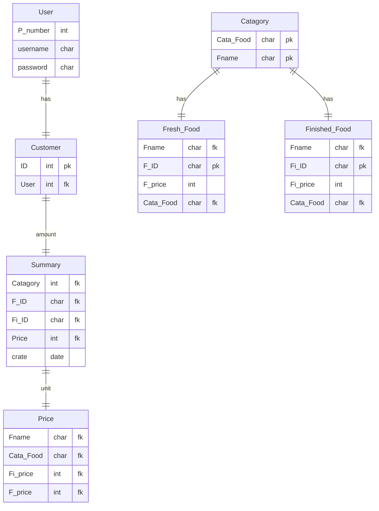

TOO FAST FOR FOODS

### User
| Field | Type | Domain | Key |
| ---   |  --- |  ---   | --- |
|P_number | int |  |  |
|username | char | 255 | |
|password | char | 255 | |

### Customer
| Field | Type | Domain | Key |
| ---   |  --- |  ---   | --- |
|ID | int | 10 | PK |
|User | char | () | FK |

### Catagory
| Field | Type | Domain | Key |
| ---   |  --- |  ---   | --- |
|Cata_Food | char | 255 | PK |
|Fname | char | 255 | PK |

### Fresh_Food
| Field | Type | Domain | Key |
| ---   |  --- |  ---   | --- |
|Fname | char | () | FK |
|F_ID | char | 10 | PK |
|F_price | int | () | |
|Cata_Food | char | () | FK |

### Fresh_Food
| Field | Type | Domain | Key |
| ---   |  --- |  ---   | --- |
|Fname | char | () | FK |
|Fi_ID | char | 10 | PK |
|Fi_price | int | () | |
|Cata_Food | char | () | FK |

### Price
| Field | Type | Domain | Key |
| ---   |  --- |  ---   | --- |
|Fname | char | () | FK |
|Cata_Food | char | () | FK |
|Fi_name | int | () | FK |
|F_name | int | () | FK |

### Summary
| Field | Type | Domain | Key |
| ---   |  --- |  ---   | --- |
|Catagory | int | () | FK |
|F_ID | char | () | FK |
|Fi_ID | char | () | FK |
|Pirce | int | () | FK |
|create | date | () |  |